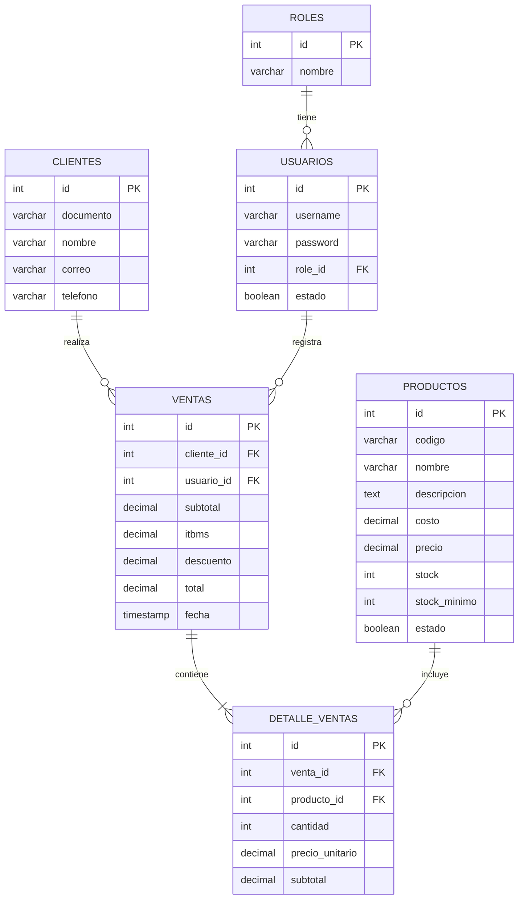

# Documentación Técnica: Sistema de Gestión de Inventario y Facturación

---

## 1. Portada
**Proyecto Final:** Sistema Web de Gestión de Inventario y Facturación para Miniempresa
**Curso:** [Nombre de tu Curso / Materia]
**Integrantes:** [Nombres de los Estudiantes]
**Fecha:** [Fecha de Entrega]

---

## 2. Introducción y Objetivos

### Introducción
El presente documento detalla la arquitectura, el diseño y la implementación de un sistema web transaccional desarrollado para una miniempresa. El sistema abarca el ciclo completo de punto de venta (POS) y la gestión dinámica de inventario. Se hizo hincapié en la mitigación de vulnerabilidades informáticas, usando un patrón MVC puro con PHP, persistencia de datos segura mediante PDO, Procedimientos Almacenados en MySQL y una interfaz dinámica reactiva mediante Fetch API.

### Objetivo General
Desarrollar un sistema web seguro y robusto para la gestión y facturación de una miniempresa que permita un control estricto de accesos, ventas en tiempo real, emisión de facturas JSON y notificaciones asíncronas de stock.

### Objetivos Específicos
1. Implementar la arquitectura **Modelo-Vista-Controlador (MVC)** para separar la lógica de negocio, de acceso a datos y de presentación.
2. Construir una **API RESTful** que entregue reportes y facturas en formato **JSON**.
3. Asegurar la persistencia de datos utilizando **PDO** (PHP Data Objects) e invocando **Procedimientos Almacenados**.
4. Superar el **reto de control de stock** incorporando eventos asíncronos mediante AJAX/Fetch, logrando emitir alertas tempranas de inventario sin recargar la página.

---

## 3. Diagrama Entidad-Relación (DER)

A continuación, se representa la estructura relacional central del sistema:



---

## 4. Capturas de Pantalla de la Interfaz (Espacios)

*(Instrucción para los estudiantes: Pegar las capturas de pantalla de la ejecución del sistema aquí antes de exportar a PDF)*

- **[INSERTAR CAPTURA: Login del Sistema]**
- **[INSERTAR CAPTURA: Dashboard Principal con Alerta de Stock]**
- **[INSERTAR CAPTURA: Módulo de Punto de Venta (POS)]**
- **[INSERTAR CAPTURA: Factura JSON generada al finalizar la venta]**

---

## 5. Estructura de Carpetas, Arquitectura y Tecnologías

### Tecnologías Utilizadas
- **Backend**: PHP 8+ Puro (Vanilla).
- **Frontend**: HTML5, CSS3, Vanilla JS (Fetch API). Google Fonts (Inter) y BoxIcons.
- **Base de Datos**: MySQL Relacional.
- **Seguridad**: Hasheo de contraseñas (`PASSWORD_BCRYPT`), mitigación de Inyección SQL (PDO Statements y Call de Procedimientos Almacenados).

### Estructura de Carpetas
```text
/
├── api/
│   └── index.php             # Enrutador de la API REST (Devuelve respuestas JSON)
├── config/
│   └── Database.php          # Configuración de PDO y manejo de Excepciones
├── controllers/
│   ├── AuthController.php    # Lógica de Inicio/Cierre de sesión
│   ├── ClientController.php
│   ├── ProductController.php
│   └── SaleController.php    # Controla el flujo POST de la Venta (POS)
├── database/
│   └── schema.sql            # Script SQL: Creación de Tablas y Stored Procedures
├── models/
│   ├── Cliente.php
│   ├── Producto.php
│   ├── Usuario.php
│   └── Venta.php             # Lógica Transaccional (PDO commit/rollback)
├── public/
│   ├── css/style.css         # Estilos (Diseño Premium UI)
│   └── js/app.js             # Lógica asíncrona de alertas y carrito de compras
├── views/                    # Vistas HTML incrustadas con PHP
│   ├── auth/, dashboard/, clientes/, pos/, productos/
│   └── layout/               # Header, Sidebar, Modal base y Footer
└── index.php                 # Enrutador Principal MVC
```

### Arquitectura de la API REST
Se definió un sub-enrutador (`api/index.php`) que intercepta las peticiones GET. Los principales Endpoints desarrollados son:
- `GET /api/inventario/alertas`: Consulta productos donde `stock <= stock_minimo`.
- `GET /api/ventas/reportes`: Retorna historial de ventas.
- `GET /api/facturas/{id}`: Genera la visualización JSON de la factura procesada.

---

## 6. Bloques de Código Clave

### A. Controlador de la API y Enrutamiento (Reto)
El siguiente bloque muestra cómo la API intercepta la petición del frontend y retorna exclusivamente JSON:
```php
if ($endpoint === 'inventario/alertas') {
    $productoModel = new Producto($db);
    $alertas = $productoModel->obtenerAlertasStock();
    
    http_response_code(200);
    echo json_encode([
        "success" => true,
        "count" => count($alertas),
        "data" => $alertas
    ]);
    exit;
}
```

### B. Consumo Asíncrono en JavaScript (Fetch API)
El cliente JS consulta el endpoint de alertas y dibuja notificaciones en tiempo real, ejecutado tras registrar una venta:
```javascript
async function checkStockAlerts() {
    try {
        const response = await fetch('api/index.php?endpoint=inventario/alertas');
        const result = await response.json();
        
        if(result.success && result.count > 0) {
            displayStockToasts(result.data);
            const list = result.data.map(p => `${p.nombre} (Stock actual: ${p.stock})`);
            showModal('¡Alerta de Inventario!', 'Productos bajos en stock:', 'danger', list);
        }
    } catch(err) {
        console.error("Error en checkStockAlerts:", err);
    }
}
```

### C. Persistencia Transaccional PDO y Procedimientos Almacenados
El modelo `Venta.php` garantiza la atomicidad de las operaciones de venta:
```php
try {
    $this->conn->beginTransaction();

    // 1. Crear Venta Cabecera
    $query = "CALL sp_crear_venta(:cliente_id, :usuario_id, :subtotal, :itbms, :descuento, :total, @p_venta_id)";
    $stmt = $this->conn->prepare($query);
    // ... binding ...
    $stmt->execute();

    // 2. Insertar Detalles de Venta
    $query_detalle = "CALL sp_crear_detalle_venta(:venta_id, :producto_id, :cantidad, :precio_unitario, :subtotal)";
    $stmt_det = $this->conn->prepare($query_detalle);

    foreach ($detalles as $det) {
        // ... binding ...
        $stmt_det->execute(); // Si no hay stock, el SP falla y arroja error a PDO
    }

    $this->conn->commit();
} catch (Exception $e) {
    $this->conn->rollBack();
    throw $e;
}
```
